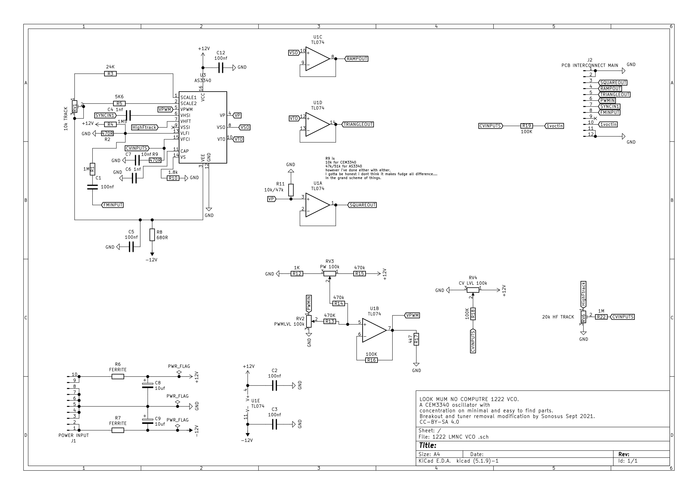

# Introduction

This is a small form factor VCO board. It is designed to be modular so it is possible to add or remove certain functions to build a customized module.
It is based around the popular CEM3340 chip. In its fully populated configuration, it has the following features:
- Ramp, triangle, and square waveform outputs.
- Voltage controlled pulse width modulation for the square waveform output.
- 1 volt per octave control voltage input.
- Linear frequency modulation input.
- Accurate tracking over at least 7 octaves.

 |      |                          |
| ----------- | ------------------------------------ |
| Width     | Custom  |
| Cost       | ~£15 |
| Power draw    | ? |

With intermediate soldering and circuit debugging skills, this module can be completed in under 2 hours.

- Images

# Design

The circuit is based around the popular CEM3340 voltage controlled oscillator chip. It is also compatible with the AS3340 and V3340 chip. It has two trimmer potentiometers for adjusting the 1v/octave tracking. All waveform outputs are buffered via the TL074 quad op amp chip. A full schematic is shown below.

# Building

    
20/06/2022 20:58:12

Generated from schematic by Eeschema (6.0.0)

**Component Count:** 45

| Refs | Qty | Component | Description | Tayda SKU |
| ----- | --- | ---- | ----------- | ---- |
| C1, C2, C3, C5, C12 | 5 | 100nf | Ceramic capacitor | A-553 |
| C4 | 1 | 1nf | Ceramic capacitor | A-965 |
| C6 | 1 | 1nf | High quality box capacitor | A-1531 |
| C7 | 1 | 10nf | Ceramic capacitor | A-962 |
| C8, C9 | 2 | 10uf | Polarised electrolytic capacitor | A-4554 |
| H1, H2, H3, H4, H5, H6, H7 | 7 | 6.35mm jack | Audio jack | A-1121 |
| J1 | 1 | POWER INPUT | 2x5 pin box header | A-2939 |
| R1, R22 | 2 | 1M | Resistor | A-2277 |
| R2, R9 | 2 | 470R | Resistor | A-2247 |
| R3 | 1 | 24K | Resistor | A-2771 |
| R4 | 1 | 1M5 | Resistor | A-2783 |
| R5 | 1 | 5K6 | Resistor | A-2351 |
| R6, R7 | 2 | FERRITE |  |  |
| R8 | 1 | 680R | Resistor | A-2281 |
| R10 | 1 | 1.8k | Resistor | A-2340 |
| R11 | 1 | 10k/47k | Resistor (See docs) | A-2279 |
| R12 | 1 | 1K | Resistor | A-2200 |
| R13, R14, R15 | 3 | 470k | Resistor | A-2180 |
| R16, R18, R19 | 3 | 100K | Resistor | A-2248 |
| R17 | 1 | 4k7 | Resistor | A-2310 |
| RV1 | 1 | 10k TRACK | Bourns 3296W trimmer(1v/oct tracking) | A-586 |
| RV2, RV3, RV4 | 3 | 100k | Potentiometer(Frequency) |  |
| RV6 | 1 | 20k  | Bourns 3296W trimmer (HF tracking) | A-592 |
| U1 | 1 | TL074 | Quad operational amplifier | A-1138 |
| U3 | 1 | AS3340 | (CEM/AS/V)3340 chip |  |

- PCB availability, Gerbers
- General overview/component type
- Panel wiring
- PCB mistakes/modifications
- PCB renderings

# Testing
- continuity test
- chipless power up
- Calibration

# Playing
- patch notes/audio demos
- patch ideas
- alternative uses

# License
- CC-BY-SA-4.0
- OSHWA cert