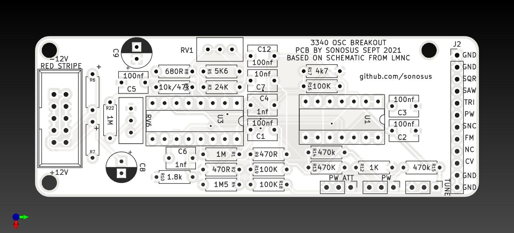

# Introduction

This is a small form factor VCO board. It is designed to be modular so it is possible to add or remove certain functions to build a customized module.
It is based around the popular CEM3340 chip. In its fully populated configuration, it has the following features:

- Ramp, triangle, and square waveform outputs.
- Voltage controlled pulse width modulation for the square waveform output.
- 1 volt per octave control voltage input.
- Linear frequency modulation input.
- Accurate tracking over at least 7 octaves.

 |      |                          |
| ----------- | ------------------------------------ |
| Width     | Custom  |
| Cost       | ~£15 |
| Power draw    | ? |

With intermediate soldering and circuit debugging skills, this module can be completed in under 2 hours.

- Images

# Design

The circuit is based around the popular CEM3340 voltage controlled oscillator chip. It is also compatible with the AS3340 and V3340 chip. It has two trimmer potentiometers for adjusting the 1v/octave tracking. All waveform outputs are buffered via the TL074 quad op amp chip. A full schematic is shown below.

# Building

### Bill of Materials

A BoM is shown below.
 

  
Bill of Materials
   

Notes:

- R6/R7 can be either ferrite beads, 1N5817 diodes, or 10 ohm resistors. If using diodes, ensure the cathode (end with the stripe) is in the hole nearest the + on the silkscreen.

- C8/C9 are optional but recommended to ensure power stability is maintained.

- R11 should be 10k if using the CEM3340 chip and 47k if using the AS3340 chip. In practice, however, any value from 10-50k should suffice.

A rendering of the PCB is shown.

!!! info
    Certain components can be omitted from the board to remove unused features, if desired.

    === "Base"

        These are required in all configurations. Use only the following components to create a VCO with ramp and sawtooth waveform outputs, one 1v/oct input, and one tune control.

        - J1
        - U1, U3
        - R2, R3, R4, R5, R6, R7, R8, R9,R10, R18, R22
        - C2, C3, C5, C6, C7, C12
        - RV1, RV4, RV6

        Use a piece of wire to bridge R17.
    === "Pulse waveform"

        These are required to add a pulse output with pulse width control.

        - R11, R12, R14, R15, R16, R17
        - RV3

    === "Pulse waveform with PWM CV"
        These are required to add a pulse output with pulse width control and a pulse width modulation input with attenuator control.

        - R11, R12, R13, R14, R15, R16, R17
        - RV2, RV3
    === "Linear FM"
        The following additional components are required to add a linear FM control voltage input:
        - R1
        - C1
    === "Sync"
        The following additional components are required to add a hard sync input jack:
        - C4

- General overview/component type
- Panel wiring
- PCB mistakes/modifications
- PCB renderings

# Testing
- continuity test
- chipless power up
- Calibration

# Playing
- patch notes/audio demos
- patch ideas
- alternative uses

# License
- CC-BY-SA-4.0
- OSHWA cert