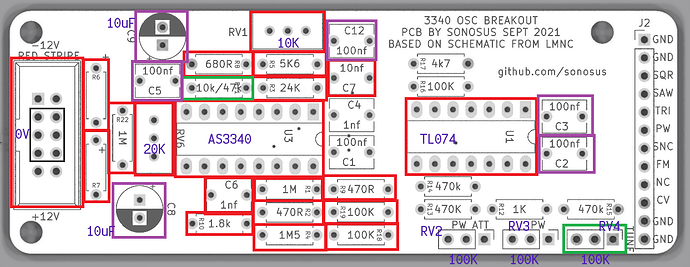

# Introduction

<figure class="inline end" markdown>
  
  <figcaption>An assembled 'base' PCB in a 2.5cm Kosmo module</figcaption>
</figure>

This project is a small form factor voltage controlled oscillator board. It is designed to be modular, permitting the user to add or remove certain functions to build a customized module.
It is based around the popular CEM3340 chip. In its fully populated configuration, it has the following features:

- Ramp, triangle, and pulse waveform outputs.
- Voltage controlled pulse width modulation on the pulse waveform output.
- 1 volt per octave control input.
- Linear frequency modulation input.
- Hard sync input.
- Accurate tracking over at least 7 octaves.

 |      |                          |
| ----------- | ------------------------------------ |
| Width     | Custom  |
| Cost       | ~£15 |
| Power draw    | ? |

With intermediate soldering and circuit debugging skills, this module can be completed in under 2 hours.

# Design

The circuit is based around the popular CEM3340 voltage controlled oscillator chip. It is also compatible with the AS3340 and V3340 chip. It has two trimmer potentiometers for adjusting the 1v/octave tracking. All waveform outputs are buffered via the TL074 quad op amp chip. A full schematic is shown below.

# Building

## Bill of Materials

The bill of materials can be found [here](3340breakout-bom.md).
An interactive bill of materials

Notes:
- Read the Customization section below as some components can be ommitted.

- R6/R7 can be either ferrite beads, 1N5817 diodes, or 10 ohm resistors. If using diodes, ensure the cathode (end with the stripe) is in the hole nearest the + on the silkscreen.

- C8/C9 are optional but recommended to ensure power stability is maintained.

- R11 should be 10k if using the CEM3340 chip and 47k if using the AS3340 chip. In practice, however, any value from 10-50k should suffice.

- You will require 2-7 jack sockets depending on your board's configuration.

## Board rendering
A rendering of the PCB is shown.
{ width=800 .zoom}

[irregularshed](https://lookmumnocomputer.discourse.group/u/irregularshed/summary) has added the missing component values and reference designators from the schematic on this nice annotated image.

<figure markdown>
{ width=750 .zoom}
  <figcaption>Annotated PCB rendering</figcaption>
</figure>

## Customization
This board is designed so that certain components can be omitted from the board to remove unused features if desired.

!!! info
    Base features are always required.

=== "Base"

    { width=500 align=right .zoom}
    These are required in all configurations. Use only the following components to create a VCO with ramp and sawtooth waveform outputs, one 1v/oct input, and one tune control.

    - J1
    - U1, U3
    - R2, R3, R4, R5, R6, R7, R8, R9,R10, R18, R22
    - C2, C3, C5, C6, C7, C12
    - RV1, RV4, RV6
    
    Use a piece of wire to bridge R17 if no pulse wave is to be added.

=== "Pulse waveform"

    { width=500 align=right .zoom}
    The following additional components are required to add a pulse output with pulse width control.

    - R11, R12, R14, R15, R16, R17
    - RV3
    
   

=== "Pulse waveform with PWM CV"
    
    { width=500 align=right .zoom}
    These are required to add a pulse waveform output with pulse width control and an additional pulse width control voltage input with attenuator.

    - R11, R12, R13, R14, R15, R16, R17
    - RV2, RV3

=== "Linear FM"
    
    { width=500 align=right .zoom}
    The following additional components are required to add a linear FM control voltage input:
    
    - R1
    - C1

=== "Sync"
    
    { width=500 align=right .zoom}
    
    The following additional components are required to add a hard sync input jack:
    
    - C4

## Panel Hardware

The panel components are mounted off board.

The three potentiometers (TUNE, PW, and PW ATT) should be affixed to the panel and connected to the board via 3 wires.

The header J2 is designated for connections to panel jacks. Not all jacks are used depending on the configuration of the board.

|Pin|Silkscreen|Description|
|---|---|---|
|1|GND|Ground connection|
|2|GND|Ground connection|
|3|SQR|Pulse waveform output|
|4|SAW|Ramp waveform output|
|5|TRI|Triangle waveform output|
|6|PW|Pulse width modulation input|
|7|SNC|Hard sync input|
|8|FM|Linear FM input|
|9|NC|Not connected, empty pin|
|10|CV|1v/oct note input|
|11|GND|Ground connection|
|12|GND|Ground connection|
|~|TUNE|Tuning control|
|~|PW|Pulse width control|
|~|PW ATT|Pulse width input attenuator|

Connect the relevant pin on the header to the tip of the jack.
The sleeve of each jack should be connected to ground. 
For this board, the tip/sleeve normal pins are not used and can be left unconnected.
It is recommended to use 28AWG wire or thicker for board-panel connections.

# Testing

## Testing power integrity

Before the board can be used, it must be tested to ensure correct functionality.
!!! warning
    Failure to follow these steps could result in damage to the chips, your power supply, or other modules.
1. Remove the ICs from their sockets if installed.
2. Check for continuity between the power rails and ground. There should be no connection between +12V, ground, or -12V.
3. Apply power to the board. With the common probe of your multimeter connected to ground, verify the voltages on the IC sockets.

|Chip|Pin|Voltage|
|---|---|---|
|CEM3340|16|+12V|
|CEM3340|3|-6.5V|
|TL074|4|+12V|
|TL074|11|-12V|

4. carefully install the CEM3340 and TL074 chips. Verify the notches on the DIP packages match the markings on the silkscreen before applying power to the board.

## Calibrating the module

These steps will ensure the oscillator plays in tune to 1v/octave.

1. Turn the high frequency tracking trimmer (RV6, next to the power header) all the way anticlockwise so its middle pin is measured to be at ground.
2. Connect a 1v/octave signal source (MIDI-CV converter, arpeggiator, etc) to the CV input jack. Set it to play octave arpeggios (C3, C4, C5, for instance.)
3. Set the tuning control pot so that the lowest note in the arpeggio is around A3.
3. Connect a speaker to one of the waveform outputs. Turn the 1v/oct tracking trimmer (RV1) until the oscillator is playing octaves in tune. Ideally this should be measured with a digital tuner.
4. Turn the tuning pot so the lowest note in the sequence is around an A6. Turn the high frequency trimmer so the octaves are in tune as before.

Your board should now be ready to be installed behind a panel or in an enclosure. 

# License

This project is registered Open Source Hardware.

 This work is licensed under a <a rel="license" href="http://creativecommons.org/licenses/by-sa/4.0/">Creative Commons Attribution-ShareAlike 4.0 International License</a>.
