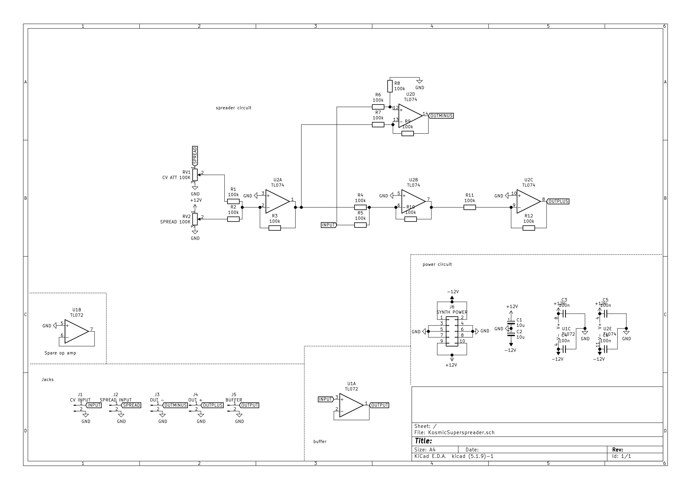

# Kosmic Superspreader

This is a CV-controlled 'spread' module for providing evenly offset control voltages, perfect for detuning oscillators or equally varying filter cutoffs.

It takes a CV input. A 'spread' value is then:
- added to the CV input and sent to the + output
- subtracted from the CV input and sent to the - output
The CV input is also buffered and sent to the Buffer output.

The spread value is determined by adding together the value of the Spread knob (ranging from 0 to 12V) and the value of the Spread CV input (attenuated by the CV ATT knob).

 |      |                          |
| ----------- | ------------------------------------ |
| Width     | 5cm  |
| Cost       | ~£15 |
| Power draw    | ? |

- Images
# Design

The circuit is based around a single TL074 op amp. 

The spread value is determined by summing the voltages from the wipers of RV1 and RV2 through an inverting summing amplifier (U2A). 
The input CV is summed with the spread value through another inverting summing amplifier(U2B) which is then inverted a second time with a unity gain inverting amplifier (U2C) to get the - output of the module.
The spread value is subtracted from the input CV (remember the input CV is inverted) through a unity gain differential amplifier to get the + output of the module. 
To make the buffer output, the input CV is fed through a voltage follower (U1A) whose output is connected ot the buffer jack.

## Schematic

# Building

## BOM
The bill of materials is shown below.

Note: the capacitors are optional but recommended to ensure module stability.
Other components you will require for a full build:

- 2 IC sockets (DIP8 and DIP14, highly recommended)
- 1 panel/PCB set
- 2 knobs (any will suffice, I 3D print them)
- 1 Kosmo power cable
- 4 suitable wood/machine screws for mounting the module in your case

### PCB
The latest PCB/panel Gerber files are available on [GitHub](github.com/sonosus/kosmicsuperspreader/releases/latest) for download.
I may also have some PCBs available for you to purchase for a competitive price (less than £7-8). If you are interested in buying a board set, please contact me.

### Resistor Matching
For accurate 1v/oct tracking, it is desirable to match certain sets of resistors as closely as your ohmmeter allows. These are:

- R4, R5, R10
- R11, R12
- R6, R8
- R7, R9

## Main board
As always, start with the smallest components on the board and work your way upwards. Populate the matched resistors first then install the remaining resistors. Solder down the IC sockets and capacitors. Ensure the polarity of C1 and C2 is correct. The ceramic capacitors have no polarity.

## Panel and switchgear
### Pots
Insert the potentiometers RV1 and RV2 into the board without soldering them down. Offer up the panel to the PCB and screw the nut onto the potentiometers to affix them to the panel. Assert that the PCB is parallel to the panel and the fastening nut on the pots is tightened then solder the pots onto the PCB.
### Jacks
Insert the jack sockets into their corresponding holes in the panel. Tighten their fastening nuts to hold them to the panel. 

### Wiring

The square pads on the PCB are for the signal connection and the round pads are connected to ground. Solder a length of stranded wire from one of the round pads on the board to the ground pin on any of the jack sockets. The ground plane on the panel will tie together the sleeves on the jacks, only requiring one ground wire to be used.

Solder wires from the square pins on the board to the tip of the corresponding jack socket:

- + on PCB to + jack
- - on PCB to - jack
- SPREAD on PCB to CV jack
- IN on PCB to IN jack
- BUFFER on PCB to BUFFER jack.

- Panel wiring
- PCB mistakes/modifications
- PCB renderings

# Testing
- continuity test
- chipless power up
- Calibration

# Playing
- patch notes/audio demos
- patch ideas
- alternative uses

# License
- CC-BY-SA-4.0
- OSHWA cert